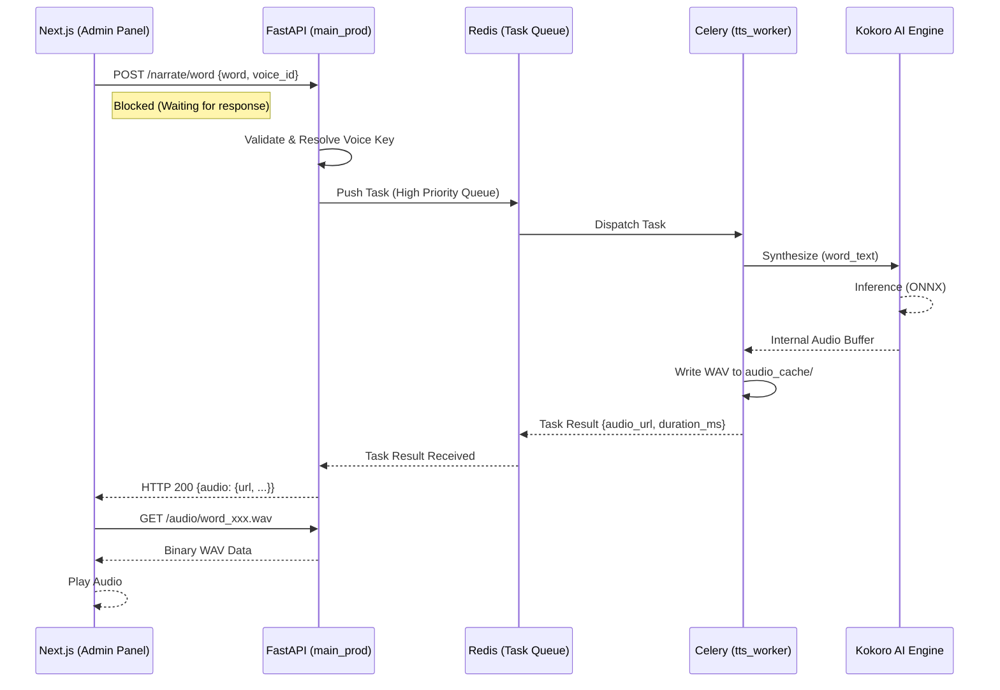

# TTS Word Generation Flow

This document provides a comprehensive overview of the synchronous, low-latency word generation pipeline in the ReadAloud system. This flow is optimized for real-time word-level assistance and voice auditioning.

## Overview Diagram



## Detailed Flow Stages

### 1. Request Initiation (Frontend)
The React application triggers a synthesis request, typically from the **Voice Registry** or a real-time assistance hook.
- **Endpoint**: `POST /narrate/word`
- **Payload**:
  ```json
  {
    "voice": { "voice_id": "bm_lewis", "language": "en-US" },
    "speech_config": { "wpm": 140 },
    "word": "adventure"
  }
  ```

### 2. API Dispatch (Backend)
The FastAPI `main_prod.py` handles the request. Unlike full stories, word requests are **synchronous**.
- **Rate Limiting**: Checked via Redis (default 60 requests/min).
- **Task Dispatch**: The request is converted into a `tts.synthesize_chunk` task and sent to a **high-priority** Celery queue to minimize latency.
- **Waiting**: The API thread blocks on `task.get(timeout=5.0)`, waiting for the AI worker to finish.

### 3. Worker Processing (Celery)
A Celery worker picks up the task.
- **Warm Model**: Each worker process maintains its own pre-loaded `BritishTTSEngine` (Kokoro v1.0 ONNX) in memory to avoid cold-start overhead.
- **Inference**: The ONNX model generates raw 24kHz PCM audio.
- **Post-Processing**: Audio is normalized, and word-level timestamps (alignment) are calculated if necessary.

### 4. Persistence & Response
- **Caching**: The resulting audio is saved as a `.wav` file in the `audio_cache/` directory with a deterministic filename based on the word and voice.
- **Result Return**: The worker returns the relative URL (e.g., `/audio/word_adventure_bm_lewis.wav`) back through the Redis result backend.
- **Final HTTP 200**: The API returns the metadata and URL to the frontend.

### 5. Playback
The frontend creates a new `Audio` object pointing to the provided URL and calls `.play()`. Since the file is already written to disk on the server, the browser fetch is near-instantaneous.

## Performance Characteristics
- **Total Latency**: ~300ms - 800ms (depending on word length and hardware).
- **Network Overhead**: Minimal (JSON metadata exchanged first, then binary fetch).
- **Concurrency**: Scalable by adding more `--concurrency` slots to the Celery workers.
